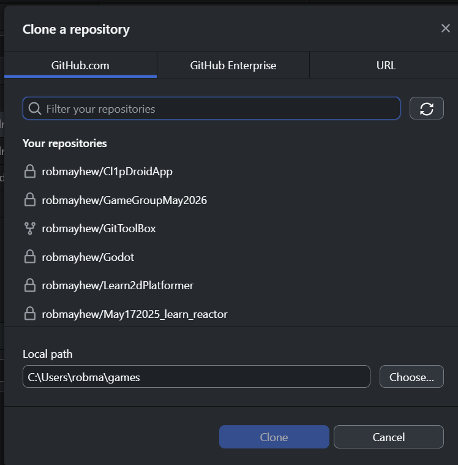
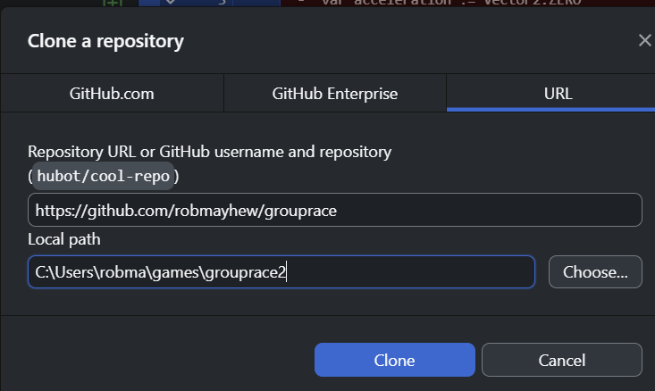
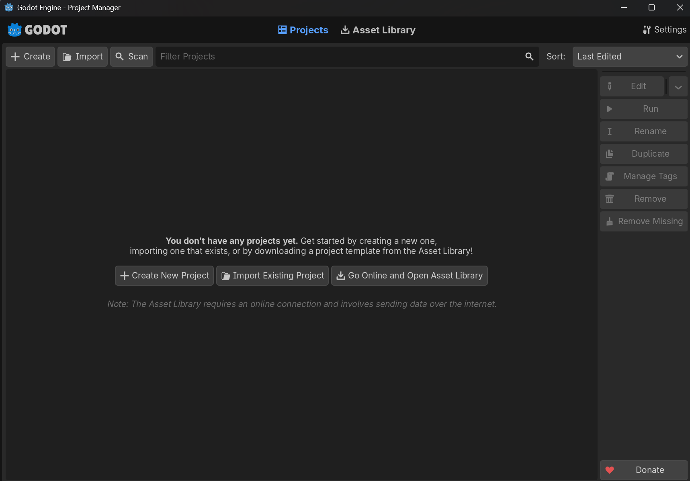
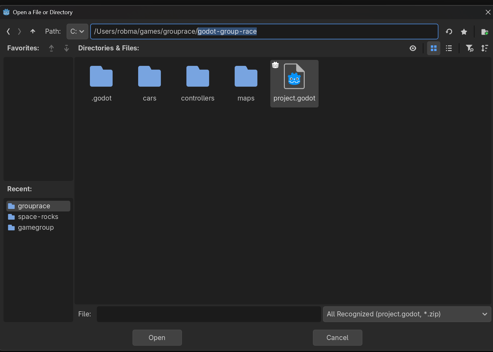
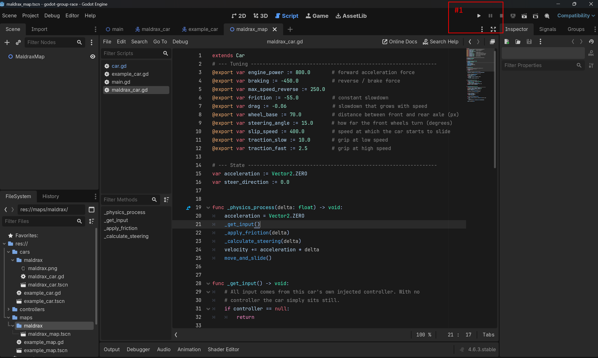
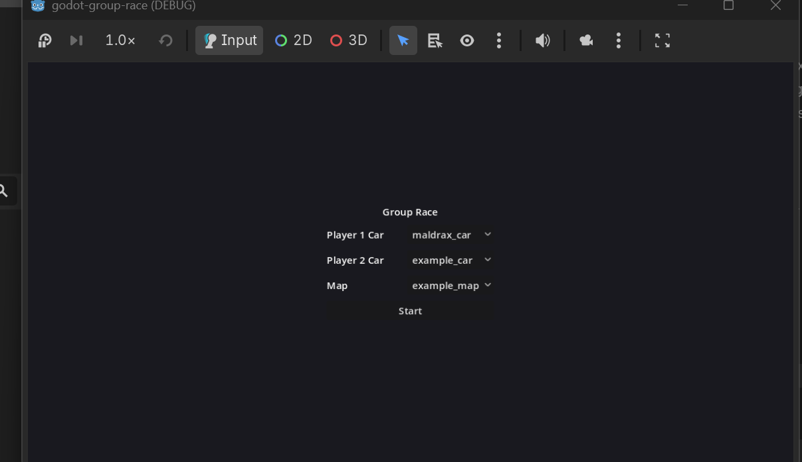

# START HERE

## Step 1 Create or Login to Guthub.com

https://github.com/

## Step 2 install a Git client. 

If you are not a git expert, I recomend Github desktop 
https://desktop.github.com/download/

## Step 3 Clone this repository

Select the URL Tab

Enter in 

https://github.com/robmayhew/grouprace

Note the LocalPath that has been copied into.

# Step 4 Download Godot game engine

https://godotengine.org/

Currently using version 1.7.x (Anything close to that will be fine)

# Step 5 Start Godot.exe 

Click Import existing project.

Select the godot-group-race sub folder. And select project.godot

Click the White Triangle to run the game. #1

The game

Select cars from the drop down menu.

Then click start.

Control one care with Arrow keys. The other withe WSAD. 
