# Make a test change 

## Before you start

You will need the following installed and set up:

- **Godot** with this project open.
- **GitHub Desktop** with this repository cloned.

**IMPORTANT:** Before you can publish a branch, you need to be added as a collaborator on the project. If you have not already done so, email rob.mayhew@gmail.com with your github.com email address so I can add you.

## Make the change

To make sure everything works lets make a simple change to the project.

With the godot project open create a new folder under the cars folder. Give it a unique name in the format `nameYYYYMMDD` (your first name followed by today's date, no spaces or underscores).

So I would be `rob20260805`.

Select the FileSystem tab

Right click on the cars folder

Select Create folder

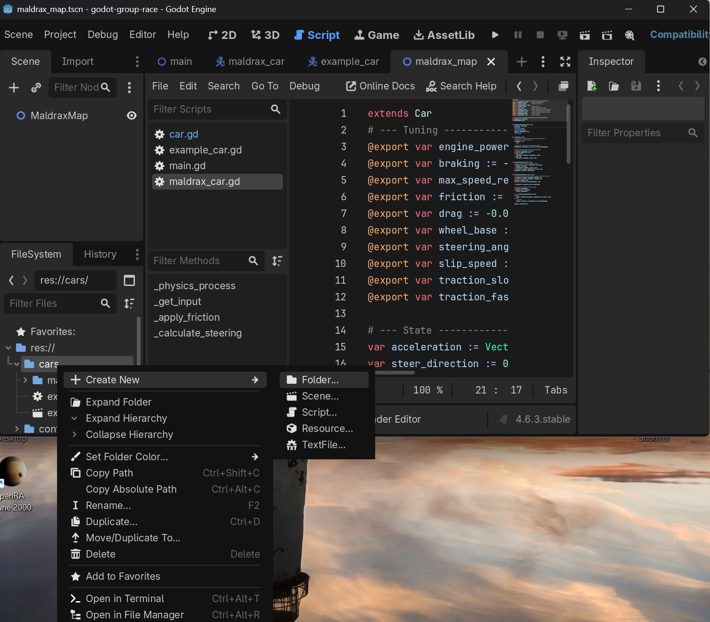

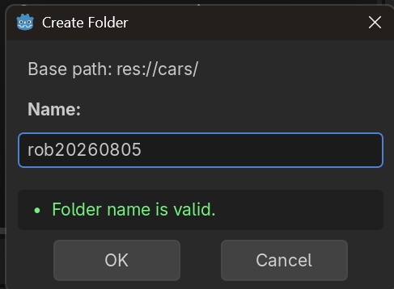

Now in this folder create a new text file.

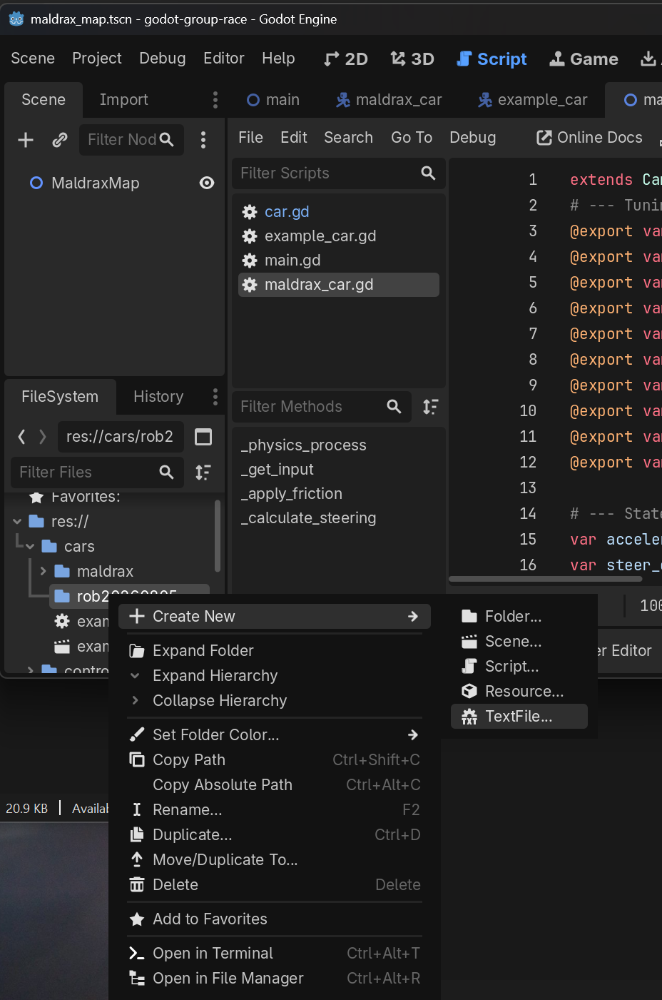

Call the file readme.txt 

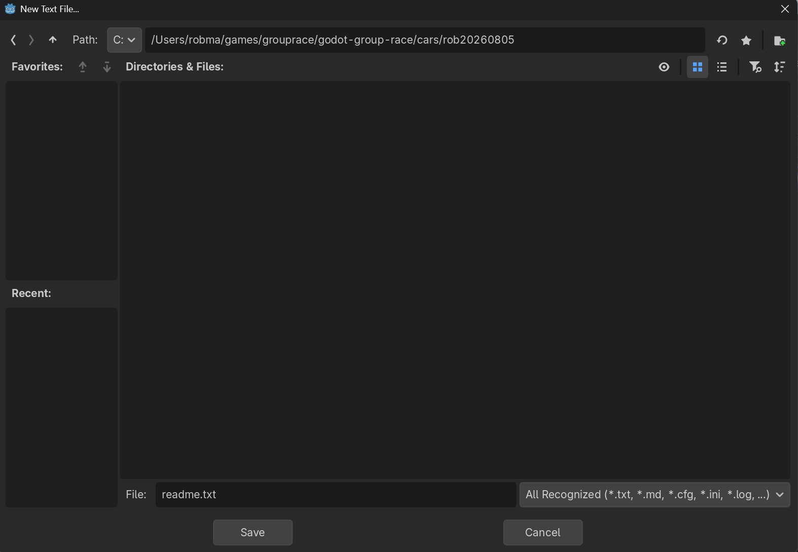

Type some text in the editor and click save. (CTRL + s)

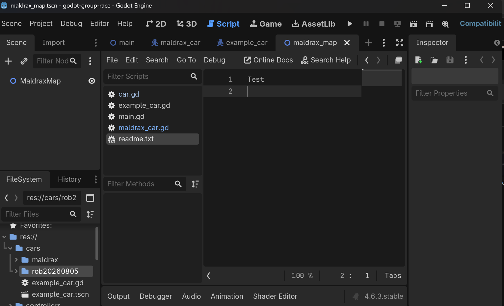

Now it's time to push these changes to github.com

Open GitHub Desktop.

Create a new branch. This is where all your changes will be made. In GitHub Desktop, click the **Current Branch** dropdown at the top, then click **New Branch**.

Give the branch a unique name.

Then click **Create Branch**.

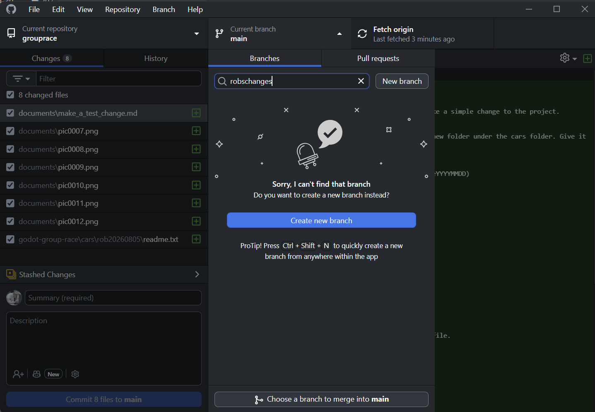

You may see the following dialog asking where to bring your changes. Click **Bring my changes to the new branch**, then click **Switch Branch**.

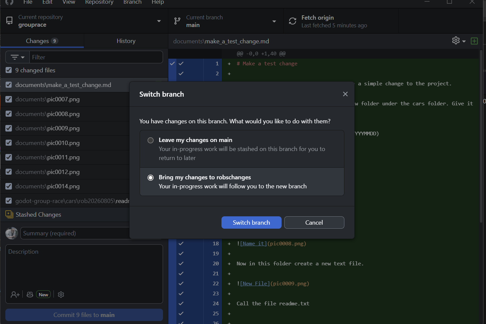

You should now see your current branch as the one you just created.

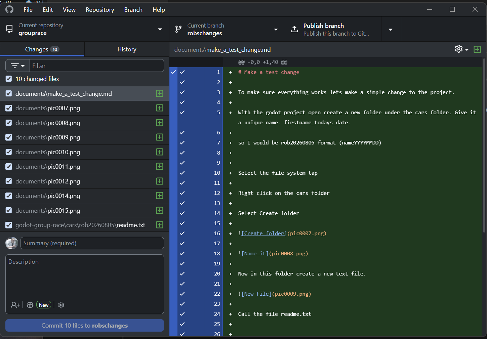

Next, click **Publish branch**. This will push the branch to github.com.

Once the branch is published, your changes are on github.com. Next up is to create a pull request.

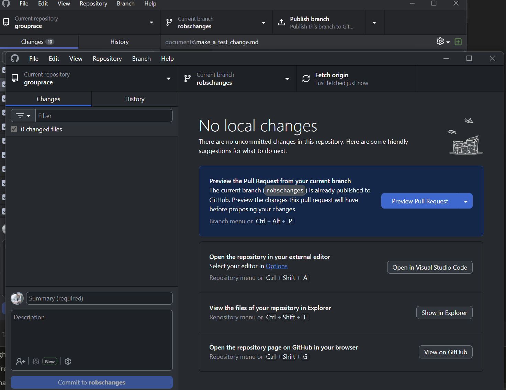

Click the **Create Preview Pull Request** button.

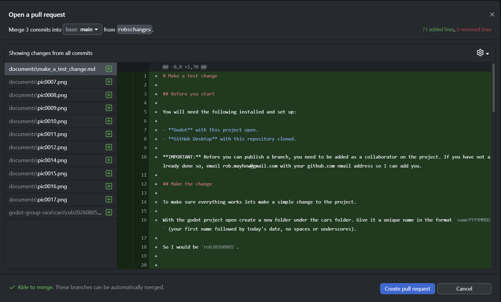

Click the **Create Pull Request** button.

This will open up github.com in a browser. Add a simple description of the change and click **Create pull request** in github.

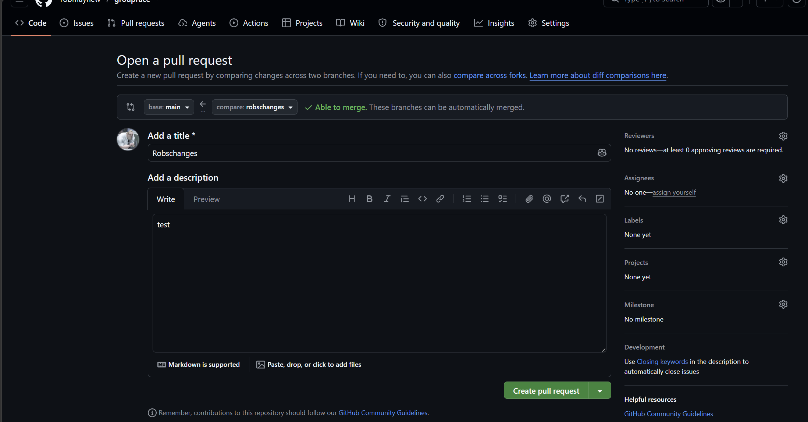

## You're done!

Your pull request is now created on github.com. Let me know the name of the branch you created and I'll take a look.

